# Управление IT-проектами - Devflow

## О проекте

Этот репозиторий содержит фронтенд часть системы для управления проектами, разработанного на React. Проект связан с [бэкенд репозиторием](https://github.com/ZIRex03/devflow-backend), где реализована серверная часть и API.

**Важно**:
1. Приложение использует локальную базу данных для разработки, поэтому приложение и его функции недоступны вдля просмотра. Функционал описан ниже в пункте скриншоты
2. Проект находится в разработке, финальная версия приложения может отличаться.
3. Проект раззработан в рамках выпускной квалификационной работы (ВКР).

## Основные функции

**Основные функции (для всех пользователей)**

* **Дашборд с аналитикой**
* **Список проектов** с поиском и фильтрацией
* **Канбан-доска задач**, разделенная по статусам (в планах/ в работе/ на проверке/ завершенные)
* **Уведомления** (о назначении задач/проектов, исключение из задач/проектов)
* **Профиль пользователя** (смена аватара и обложки)
* **Авторизация**

**Менеджерские функции (для администратора)**

* **Добавление/редактирование проектов**
* **Управление задачами** (создание, назначение участникам, редактирование)
* **Управление участниками** (добавление/удаление из проекта)
* **Генерация отчетов** (выбор проекта и периода -> предпросмотр PDF)
* **Просмотр отчетов** (загрузка PDF с сервера)

## Технологии

* **Frontend:** React, Redux Toolkit, React Router, primereact
* **Графика:** Chart.js
* **Стили:** SCSS
* **PDF-генерация:** jsPDF
* **API:** Axios
* **Сборка:** Vite

## Скриншоты интерфейса

1. **ДАШБОРД**

**Дашборд менеджера:**
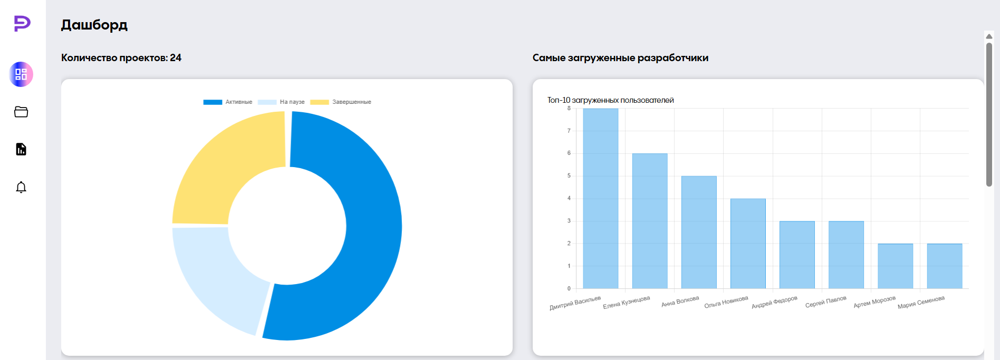
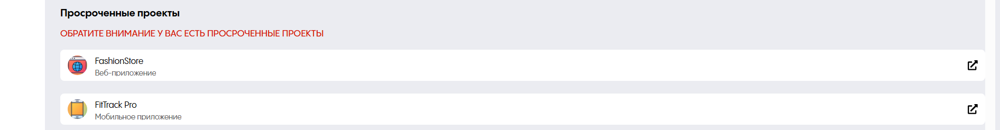
**Дашборд пользователя:**
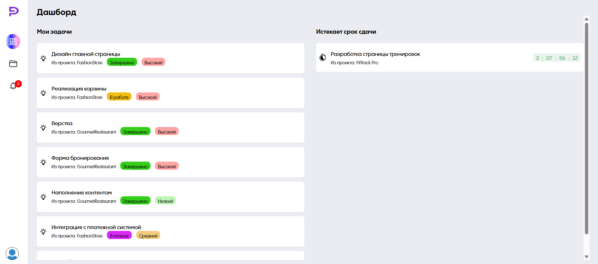

3. **ПРОЕКТЫ**
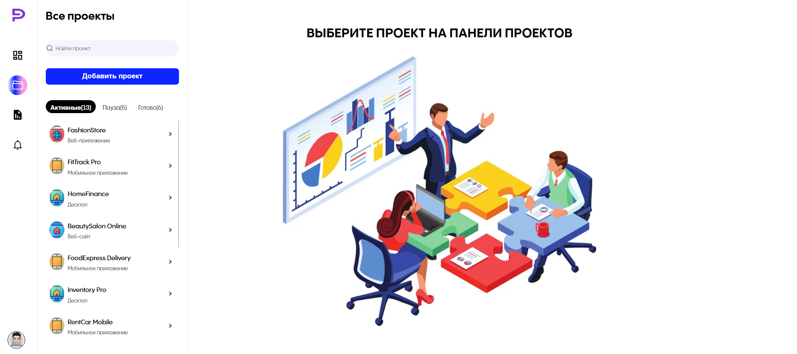
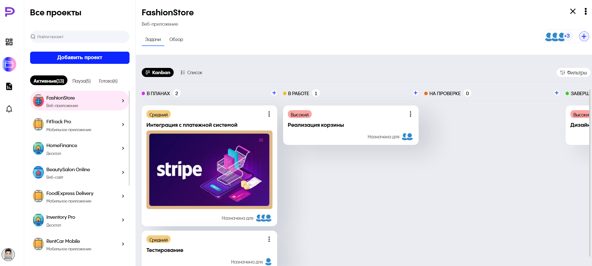
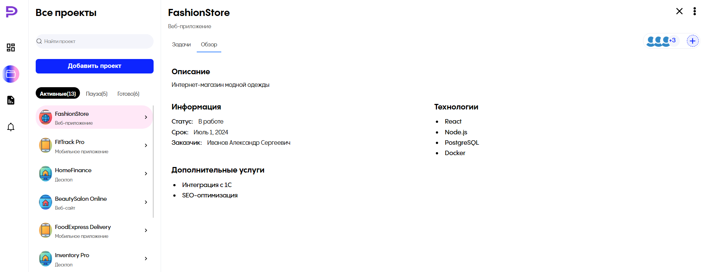
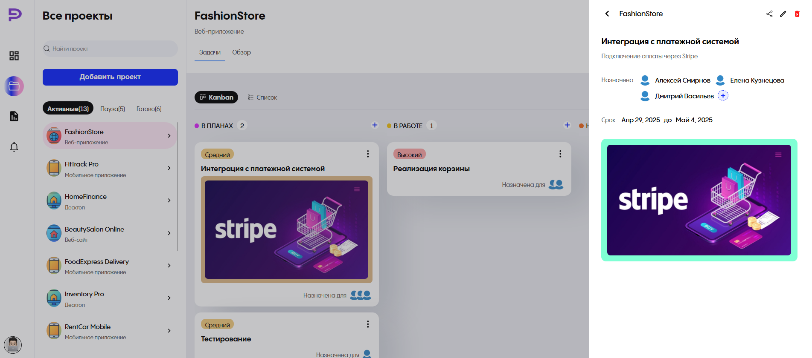
**Функции администрирования проекта:**
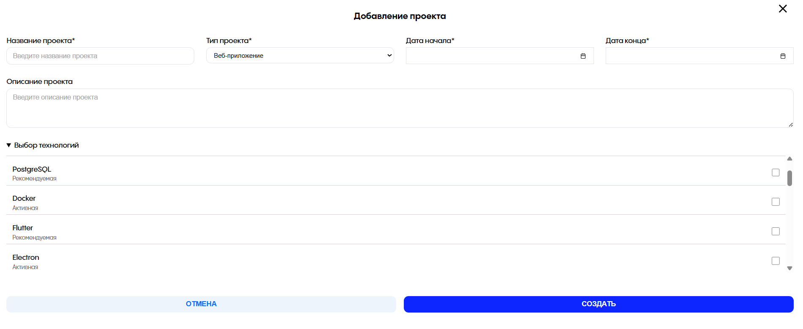
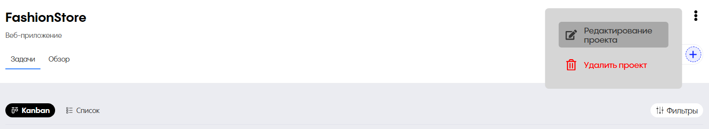
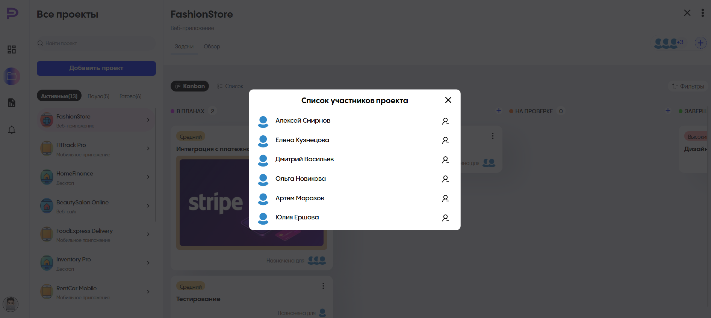
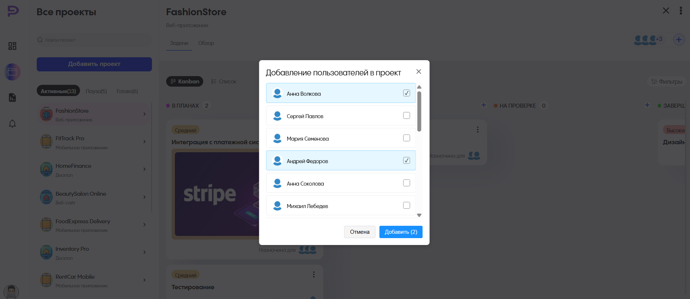
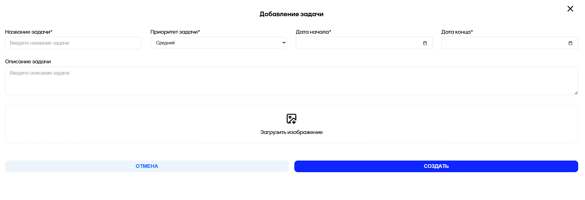
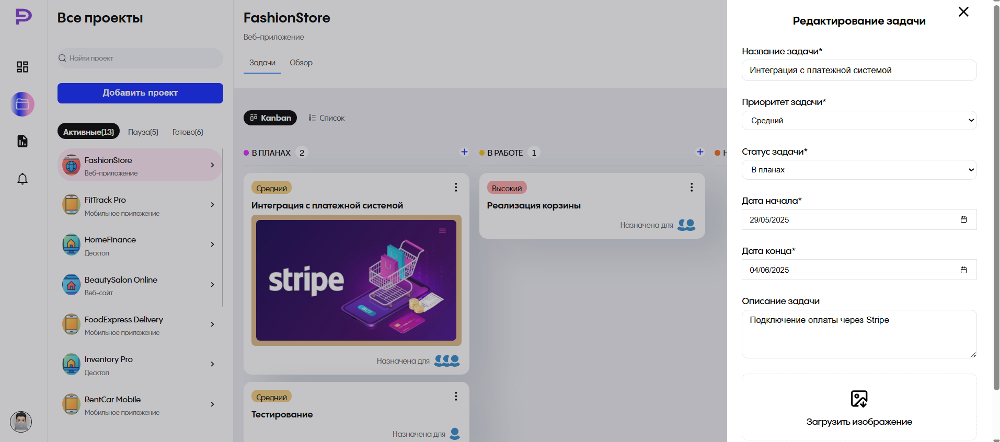
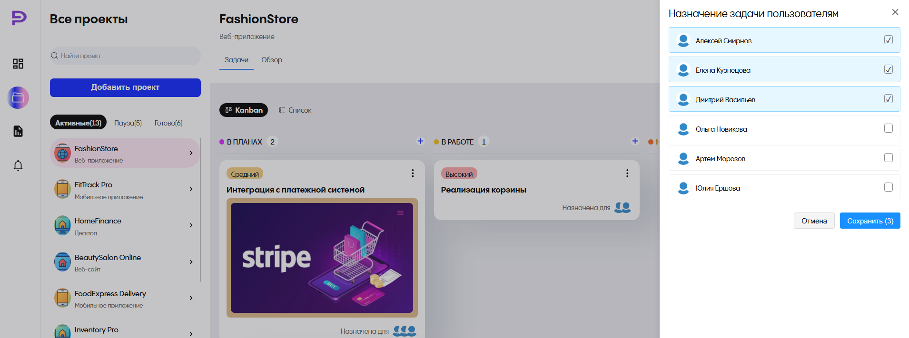

4. **ОТЧЕТЫ**
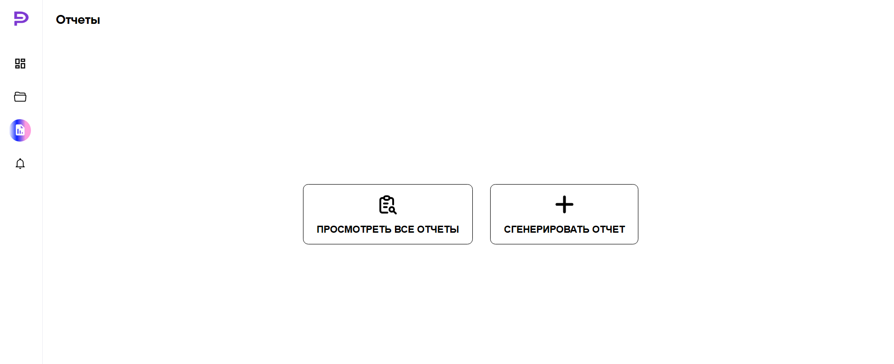
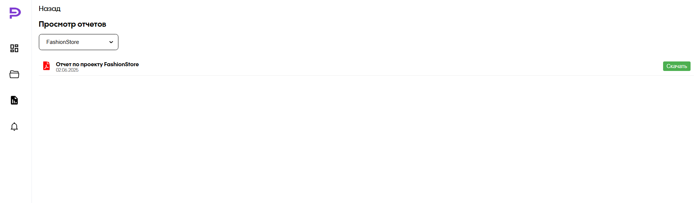
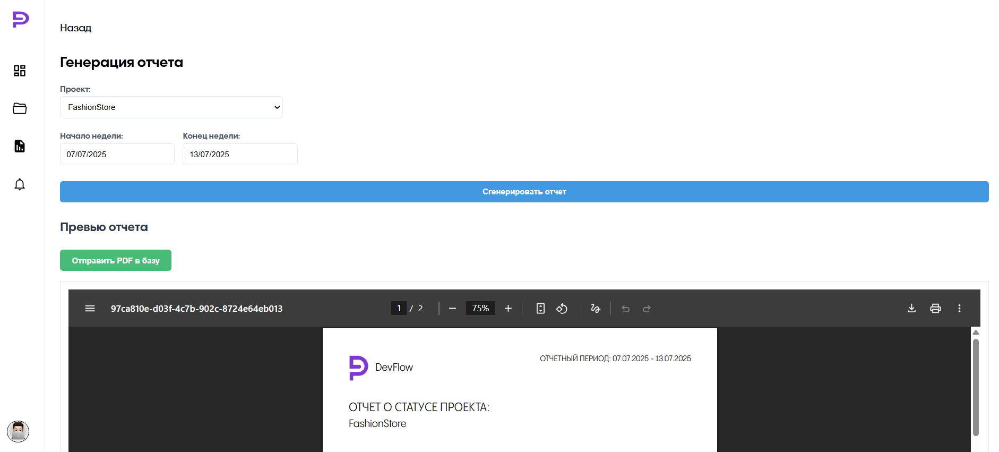

5. **Уведомления**
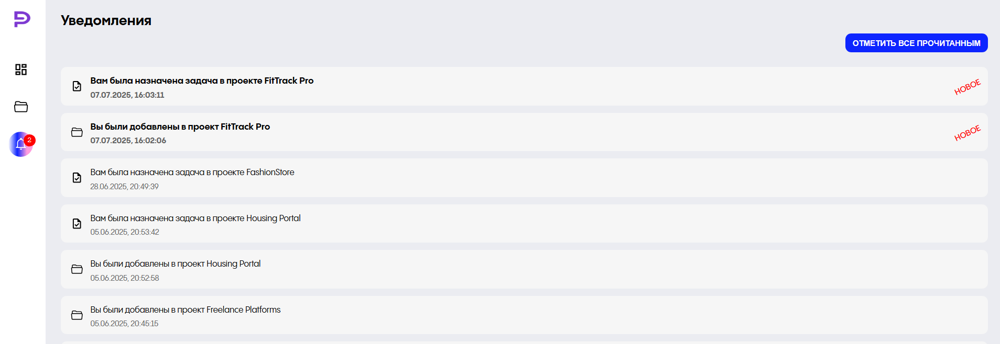

6. **Авторизация**
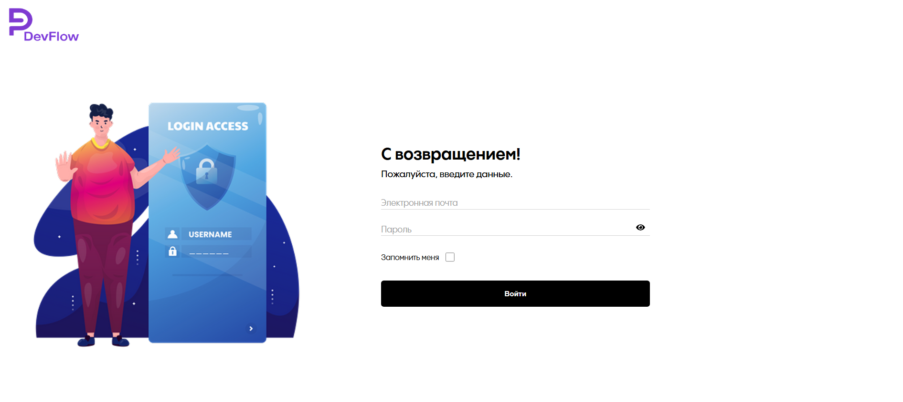
